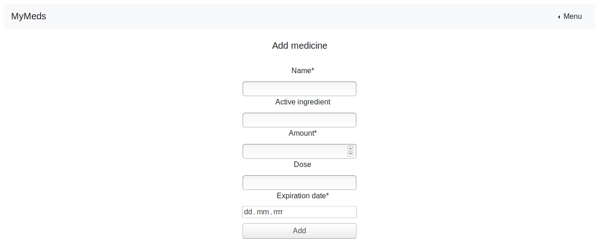
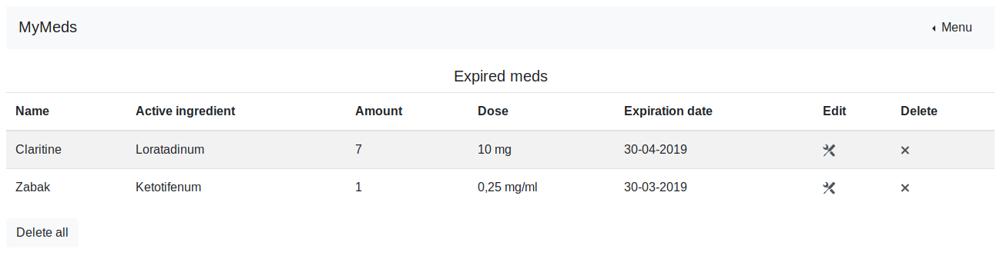

# My Meds

### Info
Simple Django app created for medicine management.


 
 
 


### Technologies
* Python 3.6 
* Django 2.1 
* PostgreSQL
* Bootstrap 4
* Celery
* Redis

### Functions
User can:
* view medicine list
* add medicine
* update medicine
* delete medicine
* view expired meds
* get email notifications when the medicine expires

### Installation
* clone repository
```
git clone https://github.com/pautomaszewska/MyMeds
```
* create virtual environment and install requirements
```
virtualenv -p pytho3 env
source env/bin/activate
pip install -r requirements.txt
```
* rename 'settings_example.py' to 'settings.py'
* create database 'medicine' and configure it in settings.py
```
psql -U 'username'
create databese medicine;
```
* run migrations for 'medications' app
```
python manage.py makemigrations medications
python manage.py migrate
python manage.py runserver
```
